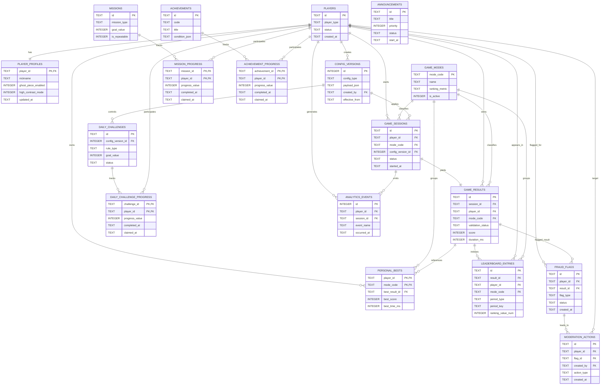

# DB설계서

## 1. 설계 원칙
- 공식 기록과 랭킹은 서버 검증 후 저장한다.
- 모드별 규칙 차이는 설정 테이블로 분리한다.
- 운영 변경 이력을 남기기 위해 설정 버전 테이블을 둔다.
- 게스트와 회원 사용자를 동일한 플레이어 프로필 모델로 수용한다.
- SQLite3 MVP 기준 실제 저장 타입을 사용한다.
- UUID는 애플리케이션 레이어에서 생성한 문자열을 `TEXT`로 저장한다.
- JSON 구조 데이터는 UTF-8 JSON 문자열을 `TEXT`로 저장하고, 필요 시 SQLite JSON1 함수로 조회한다.
- 시간 컬럼은 UTC ISO 8601 문자열 `YYYY-MM-DDTHH:mm:ss.SSSZ`를 `TEXT`로 저장한다.
- 일간/주간 집계 경계 계산은 애플리케이션에서 KST 기준으로 수행하고, 결과만 `period_key`에 반영한다.

## 1.1 SQLite3 타입 매핑 기준
| 논리 타입 | SQLite3 저장 타입 | 규칙 |
|---|---|---|
| UUID | `TEXT` | 36자 UUID 문자열 |
| 문자열 | `TEXT` | UTF-8 |
| 불리언 | `INTEGER` | `0=false`, `1=true` |
| 정수 | `INTEGER` | 64비트 정수 |
| JSON | `TEXT` | minified JSON 문자열 |
| 시간 | `TEXT` | UTC ISO 8601 |

## 1.2 UUID 생성 전략
- `players.id`, `game_sessions.id`, `game_results.id` 등 모든 ID는 애플리케이션이 생성한다.
- 기본 전략은 `UUID v7` 또는 구현체 부재 시 `UUID v4`다.
- SQLite3는 UUID 생성 함수를 기본 제공하지 않으므로 DB에서 생성하지 않는다.

## 1.3 향후 PostgreSQL 전환 예정 항목
| 현재 SQLite3 MVP | 향후 PostgreSQL 전환 시 |
|---|---|
| `TEXT` UUID | `uuid` |
| `TEXT` JSON | `jsonb` |
| `TEXT` 시간 | `timestamptz` |
| `INTEGER PRIMARY KEY` | `bigserial` 또는 `generated always` |
| 애플리케이션 bool 0/1 | `boolean` |

## 2. 주요 엔터티
| 엔터티 | 설명 |
|---|---|
| `players` | 사용자 기본 식별 엔터티 |
| `player_profiles` | 닉네임, 설정, 상태 |
| `game_sessions` | 플레이 시작 단위 |
| `game_results` | 플레이 종료 결과 |
| `leaderboard_entries` | 공식 랭킹용 결과 인덱스 |
| `daily_challenges` | 일일 챌린지 정의 |
| `missions` | 반복 미션 정의 |
| `mission_progress` | 사용자별 미션 진행도 |
| `achievements` | 업적 마스터 |
| `achievement_progress` | 사용자별 업적 상태 |
| `config_versions` | 운영 설정 버전 |
| `fraud_flags` | 의심 기록/계정 플래그 |
| `announcements` | 공지사항 |

## 2.1 ERD 개요
아래 ERD는 전체 테이블 관계를 빠르게 이해하기 위한 요약 차트다.
세부 컬럼 제약과 인덱스는 반드시 `3. 테이블 상세`를 기준으로 확인한다.

### 2.2 ERD 해석 포인트
- `players`가 대부분의 사용자별 데이터의 루트 엔터티다.
- 실제 플레이 루프의 핵심 저장 흐름은 `players -> game_sessions -> game_results -> leaderboard_entries`다.
- 반복 참여/재방문 구조는 `daily_challenge_progress`, `mission_progress`, `achievement_progress`로 분리되어 있다.
- 운영 제어 축은 `config_versions`, `fraud_flags`, `moderation_actions`, `announcements`다.
- `analytics_events`는 서비스 행동 추적용이며, 공식 기록 판정의 원본 테이블은 아니다.

## 3. 테이블 상세
## 3.1 `players`
| 컬럼 | 타입 | 제약 | 설명 |
|---|---|---|---|
| `id` | TEXT | PK | 플레이어 ID(UUID 문자열) |
| `player_type` | TEXT | not null | `guest`, `member`, `admin` |
| `guest_token_hash` | TEXT | unique null | 게스트 토큰 해시 |
| `status` | TEXT | not null | `active`, `suspended`, `deleted` |
| `created_at` | TEXT | not null | UTC ISO 8601 |
| `last_seen_at` | TEXT | not null | UTC ISO 8601 |

인덱스
- `idx_players_type_status(player_type, status)`

## 3.2 `player_profiles`
| 컬럼 | 타입 | 제약 | 설명 |
|---|---|---|---|
| `player_id` | TEXT | PK, FK players.id | 플레이어 ID |
| `nickname` | TEXT | null | 닉네임 |
| `nickname_normalized` | TEXT | index | 검색용 |
| `sound_enabled` | INTEGER | not null default 1 | 사운드 설정 |
| `vibration_enabled` | INTEGER | not null default 1 | 진동 설정 |
| `effect_level` | TEXT | not null default 'normal' | 효과 강도 |
| `ghost_piece_enabled` | INTEGER | not null default 1 | Ghost Piece |
| `high_contrast_mode` | INTEGER | not null default 0 | 고대비 모드 |
| `theme_id` | TEXT | not null default 'default' | 테마 |
| `created_at` | TEXT | not null | UTC ISO 8601 |
| `updated_at` | TEXT | not null | UTC ISO 8601 |

## 3.3 `game_modes`
| 컬럼 | 타입 | 제약 | 설명 |
|---|---|---|---|
| `mode_code` | TEXT | PK | `MARATHON`, `SPRINT`, `DAILY_CHALLENGE` |
| `name` | TEXT | not null | 표시명 |
| `ranking_metric` | TEXT | not null | `score`, `time` |
| `is_active` | INTEGER | not null | 활성 여부 |

## 3.4 `config_versions`
| 컬럼 | 타입 | 제약 | 설명 |
|---|---|---|---|
| `id` | INTEGER | PK | 버전 ID |
| `config_type` | TEXT | not null | `game_rule`, `daily`, `reward`, `season` |
| `payload_json` | TEXT | not null | JSON 문자열 |
| `effective_from` | TEXT | not null | UTC ISO 8601 |
| `effective_to` | TEXT | null | UTC ISO 8601 |
| `created_by` | TEXT | FK players.id | 생성자 |
| `created_at` | TEXT | not null | UTC ISO 8601 |

## 3.5 `game_sessions`
| 컬럼 | 타입 | 제약 | 설명 |
|---|---|---|---|
| `id` | TEXT | PK | 세션 ID(UUID 문자열) |
| `player_id` | TEXT | FK players.id | 플레이어 |
| `mode_code` | TEXT | FK game_modes.mode_code | 모드 |
| `seed` | TEXT | not null | 검증용 시드 |
| `config_version_id` | INTEGER | FK config_versions.id | 규칙 버전 |
| `device_type` | TEXT | not null | `mobile`, `desktop`, `tablet` |
| `client_version` | TEXT | not null | 앱 버전 |
| `status` | TEXT | not null | `ready`, `active`, `completed`, `abandoned` |
| `started_at` | TEXT | not null | UTC ISO 8601 |
| `ended_at` | TEXT | null | UTC ISO 8601 |

인덱스
- `idx_game_sessions_player_mode(player_id, mode_code)`
- `idx_game_sessions_started(started_at desc)`

## 3.6 `game_results`
| 컬럼 | 타입 | 제약 | 설명 |
|---|---|---|---|
| `id` | TEXT | PK | 결과 ID(UUID 문자열) |
| `session_id` | TEXT | unique, FK game_sessions.id | 세션 ID |
| `player_id` | TEXT | FK players.id | 플레이어 |
| `mode_code` | TEXT | FK game_modes.mode_code | 모드 |
| `score` | INTEGER | not null default 0 | 점수 |
| `lines_cleared` | INTEGER | not null default 0 | 제거 라인 |
| `level` | INTEGER | not null default 1 | 레벨 |
| `duration_ms` | INTEGER | not null | 플레이 시간 |
| `result_metric_json` | TEXT | not null | JSON 문자열 |
| `input_summary_json` | TEXT | not null | JSON 문자열 |
| `checkpoint_hashes_json` | TEXT | not null | JSON 문자열 |
| `idempotency_key` | TEXT | not null | 결과 제출 멱등 키 |
| `payload_hash` | TEXT | not null | 결과 payload 해시 |
| `validation_status` | TEXT | not null | `accepted`, `flagged`, `rejected` |
| `validation_reason_json` | TEXT | null | JSON 문자열 |
| `ended_reason` | TEXT | not null | 종료 원인 |
| `created_at` | TEXT | not null | UTC ISO 8601 |

인덱스
- `idx_game_results_player_mode(player_id, mode_code, created_at desc)`
- `idx_game_results_validation_mode(validation_status, mode_code)`
- `ux_game_results_session_idem(session_id, idempotency_key)`

## 3.7 `personal_bests`
| 컬럼 | 타입 | 제약 | 설명 |
|---|---|---|---|
| `player_id` | TEXT | PK, FK players.id | 플레이어 |
| `mode_code` | TEXT | PK, FK game_modes.mode_code | 모드 |
| `best_result_id` | TEXT | FK game_results.id | 최고 기록 결과 |
| `best_score` | INTEGER | null | 최고 점수 |
| `best_time_ms` | INTEGER | null | 최고 시간 |
| `updated_at` | TEXT | not null | UTC ISO 8601 |

## 3.8 `leaderboard_entries`
| 컬럼 | 타입 | 제약 | 설명 |
|---|---|---|---|
| `id` | TEXT | PK | 엔트리 ID(UUID 문자열) |
| `result_id` | TEXT | unique, FK game_results.id | 결과 ID |
| `player_id` | TEXT | FK players.id | 플레이어 |
| `mode_code` | TEXT | FK game_modes.mode_code | 모드 |
| `period_type` | TEXT | not null | `daily`, `weekly`, `all_time` |
| `period_key` | TEXT | not null | KST 기준 `2026-03-11`, `2026-W11`, `ALL` |
| `ranking_value_num` | INTEGER | not null | 점수 또는 시간 변환값 |
| `sort_direction` | TEXT | not null | `DESC`, `ASC` |
| `rank_cached` | INTEGER | null | 캐시 순위 |
| `created_at` | TEXT | not null | UTC ISO 8601 |

인덱스
- `idx_leaderboard_lookup(mode_code, period_type, period_key, ranking_value_num)`

## 3.9 `daily_challenges`
| 컬럼 | 타입 | 제약 | 설명 |
|---|---|---|---|
| `id` | TEXT | PK | 챌린지 ID |
| `title` | TEXT | not null | 챌린지명 |
| `rule_type` | TEXT | not null | `score_target`, `line_target`, `no_hold`, `time_attack` |
| `goal_value` | INTEGER | not null | 목표값 |
| `reward_type` | TEXT | not null | 보상 타입 |
| `reward_value` | INTEGER | not null | 보상 수치 |
| `config_version_id` | INTEGER | FK config_versions.id | 설정 버전 |
| `start_at` | TEXT | not null | UTC ISO 8601 |
| `end_at` | TEXT | not null | UTC ISO 8601 |
| `status` | TEXT | not null | `scheduled`, `active`, `closed` |

## 3.10 `daily_challenge_progress`
| 컬럼 | 타입 | 제약 | 설명 |
|---|---|---|---|
| `challenge_id` | TEXT | PK, FK daily_challenges.id | 챌린지 ID |
| `player_id` | TEXT | PK, FK players.id | 플레이어 |
| `progress_value` | INTEGER | not null default 0 | 진행값 |
| `completed_at` | TEXT | null | UTC ISO 8601 |
| `claimed_at` | TEXT | null | UTC ISO 8601 |
| `updated_at` | TEXT | not null | UTC ISO 8601 |

## 3.11 `missions`
| 컬럼 | 타입 | 제약 | 설명 |
|---|---|---|---|
| `id` | TEXT | PK | 미션 ID |
| `mission_type` | TEXT | not null | `play_count`, `ranking_view`, `personal_best` |
| `title` | TEXT | not null | 미션명 |
| `goal_value` | INTEGER | not null | 목표값 |
| `reward_type` | TEXT | not null | 보상 타입 |
| `reward_value` | INTEGER | not null | 보상값 |
| `is_repeatable` | INTEGER | not null | 반복 가능 여부 |

## 3.12 `mission_progress`
| 컬럼 | 타입 | 제약 | 설명 |
|---|---|---|---|
| `mission_id` | TEXT | PK, FK missions.id | 미션 ID |
| `player_id` | TEXT | PK, FK players.id | 플레이어 |
| `progress_value` | INTEGER | not null | 진행도 |
| `completed_at` | TEXT | null | UTC ISO 8601 |
| `claimed_at` | TEXT | null | UTC ISO 8601 |
| `updated_at` | TEXT | not null | UTC ISO 8601 |

## 3.13 `achievements`
| 컬럼 | 타입 | 제약 | 설명 |
|---|---|---|---|
| `id` | TEXT | PK | 업적 ID |
| `code` | TEXT | unique | 업적 코드 |
| `title` | TEXT | not null | 업적명 |
| `condition_json` | TEXT | not null | JSON 문자열 |
| `reward_json` | TEXT | not null | JSON 문자열 |

## 3.14 `achievement_progress`
| 컬럼 | 타입 | 제약 | 설명 |
|---|---|---|---|
| `achievement_id` | TEXT | PK, FK achievements.id | 업적 ID |
| `player_id` | TEXT | PK, FK players.id | 플레이어 |
| `progress_value` | INTEGER | not null default 0 | 진행도 |
| `completed_at` | TEXT | null | UTC ISO 8601 |
| `claimed_at` | TEXT | null | UTC ISO 8601 |

## 3.15 `fraud_flags`
| 컬럼 | 타입 | 제약 | 설명 |
|---|---|---|---|
| `id` | TEXT | PK | 플래그 ID |
| `player_id` | TEXT | FK players.id | 플레이어 |
| `result_id` | TEXT | FK game_results.id | 결과 ID |
| `flag_type` | TEXT | not null | `impossible_score`, `impossible_time`, `macro_pattern` |
| `severity` | TEXT | not null | `low`, `medium`, `high` |
| `status` | TEXT | not null | `open`, `reviewed`, `confirmed`, `dismissed` |
| `reason_json` | TEXT | not null | JSON 문자열 |
| `created_at` | TEXT | not null | UTC ISO 8601 |
| `reviewed_at` | TEXT | null | UTC ISO 8601 |

## 3.16 `moderation_actions`
| 컬럼 | 타입 | 제약 | 설명 |
|---|---|---|---|
| `id` | TEXT | PK | 조치 ID |
| `player_id` | TEXT | FK players.id | 대상 플레이어 |
| `flag_id` | TEXT | FK fraud_flags.id | 관련 플래그 |
| `action_type` | TEXT | not null | `exclude_result`, `rename_nickname`, `suspend_player` |
| `reason` | TEXT | not null | 사유 |
| `created_by` | TEXT | FK players.id | 운영자 |
| `created_at` | TEXT | not null | UTC ISO 8601 |

## 3.17 `announcements`
| 컬럼 | 타입 | 제약 | 설명 |
|---|---|---|---|
| `id` | TEXT | PK | 공지 ID |
| `title` | TEXT | not null | 제목 |
| `body` | text | not null | 본문 |
| `priority` | INTEGER | not null default 0 | 우선순위 |
| `start_at` | TEXT | not null | UTC ISO 8601 |
| `end_at` | TEXT | null | UTC ISO 8601 |
| `status` | TEXT | not null | `draft`, `published`, `closed` |

## 3.18 `analytics_events`
| 컬럼 | 타입 | 제약 | 설명 |
|---|---|---|---|
| `id` | INTEGER | PK AUTOINCREMENT | 이벤트 ID |
| `player_id` | TEXT | null | 플레이어 |
| `session_id` | TEXT | null | 게임 세션 |
| `event_name` | TEXT | not null | 이벤트명 |
| `properties_json` | TEXT | not null | JSON 문자열 |
| `occurred_at` | TEXT | not null | UTC ISO 8601 |
| `received_at` | TEXT | not null | UTC ISO 8601 |

## 4. 관계 요약
- `players 1:1 player_profiles`
- `players 1:N game_sessions`
- `game_sessions 1:1 game_results`
- `game_results 1:N leaderboard_entries`
- `players N:M daily_challenges` through `daily_challenge_progress`
- `players N:M missions` through `mission_progress`
- `players N:M achievements` through `achievement_progress`

## 5. 데이터 정합성 규칙
- `game_results.session_id`는 반드시 `completed` 상태의 세션과 연결되어야 한다.
- `leaderboard_entries`는 `validation_status = accepted` 결과만 생성 가능하다.
- `claimed_at`는 `completed_at` 이후여야 한다.
- 닉네임 변경 시 이전 닉네임 이력은 별도 로그 테이블로 보존한다.
- 동일 `session_id + idempotency_key` 조합은 1건만 허용한다.
- 동일 `period_key`는 KST 집계 기준으로 생성한다.

## 6. JSON 직렬화 기준
- JSON 컬럼은 공백 없는 minified JSON 문자열로 저장한다.
- 배열 순서가 의미 있는 데이터는 원본 순서를 유지한다.
- 해시 계산 대상 JSON은 키 정렬 후 직렬화한다.

## 7. 시간 저장 및 변환 규칙
- 모든 저장 시간은 UTC ISO 8601 문자열로 저장한다.
- 화면 표시 시에만 KST로 변환한다.
- 랭킹 `period_key` 계산은 저장 시간을 KST로 변환한 뒤 일/주 경계를 계산한다.
